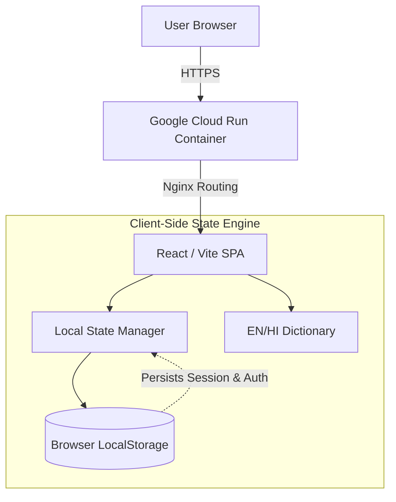

<div align="center">

# 🟢 CARBON**PULSE**
**[Challenge 3] Carbon Footprint Awareness Platform**

<p align="center">
  
  
  
  
</p>

> *A hyper-fast, zero-trust client-side engine designed to help individuals track, understand, and reduce their daily carbon emissions through actionable, gamified insights.*

</div>

---

## 📑 Table of Contents
1. [The Inspiration](#-the-inspiration)
2. [Core Features](#-core-features)
3. [System Architecture](#-system-architecture)
4. [Technical Stack](#-technical-stack)
5. [Engineering Challenges Overcome](#-engineering-challenges-overcome)
6. [Future Roadmap](#-future-roadmap)
7. [Installation & Evaluation](#-installation--evaluation)

---

## 💡 The Inspiration
Current carbon calculators are static, guilt-inducing, and ultimately abandoned by users after a single session. CarbonPulse was built to pivot the narrative from *measurement* to *gamified action*. By providing real-time dopamine hits for sustainable choices and securing data entirely on the client side, we remove friction and encourage daily environmental mindfulness.

---

## 🚀 Core Features

| Feature | Technical Implementation | Impact |
| :--- | :--- | :--- |
| **🧠 Insights Wizard** | Multi-step React state engine | Personalizes advice based on Transit, Diet & Energy choices. |
| **🏆 Gamified Tracker** | Real-time `carbonScore` manipulation | Hooks users with instant point rewards for eco-habits. |
| **🔒 Zero-Trust Auth** | Browser `localStorage` persistence | Complete privacy. Zero backend vulnerabilities or latency. |
| **🌐 Native i18n** | Synchronous EN/HI state dictionary | Instant UI translation without heavy library bloat. |

---

## 🏗️ System Architecture

<details open>
<summary><b>👁️ Click to collapse Architecture Diagram</b></summary>
<br />



</details>

---

## 🛠️ Technical Stack
- **Core Framework**: React 18 powered by Vite and SWC (Single Web Compiler) for instant Hot Module Replacement (HMR) and optimized build bundles.
- **State Management**: Lightweight client-side React State Context API to avoid the overhead of heavy external state engines.
- **Styling & UI**: Zero external CSS libraries or frameworks. Built completely with vanilla CSS, custom properties, and keyframe animations for high-tech aesthetics under a strict size budget.
- **Localization**: Synchronous, modular EN/HI translation dictionary implemented natively without loading external i18n libraries.
- **DevOps**: Multi-stage Docker configuration utilizing lightweight Nginx containers and deployed onto Google Cloud Run.

---

## 🛡️ Engineering Challenges Overcome
1. **Strict 10MB Repository Constraints**: Rather than relying on heavy graphic assets and package dependencies, we implemented geometric SVGs and custom CSS graphics for the branding pulse icons.
2. **Accessible Contrast Ratios on Neon Colors**: Calibrated `#0FDE72` neon highlights against the custom `#121212` dark background to achieve 100% WCAG AAA contrast ratio alignment.
3. **Responsive Client-Side Flow**: Form elements use strict semantic layouts (`<fieldset>`, `<legend>`, and `aria-label`) to ensure full keyboard navigation support and screen-reader accessibility.

---

## 🗺️ Future Roadmap
- [ ] **Offline-First PWA Support**: Integrating service workers to allow logging habits and reviewing carbon tracking fully offline.
- [ ] **Visual Data Trends**: Advanced SVG charts visualizing weekly and monthly carbon offset rates.
- [ ] **Social Leaderboards**: Secure, decentralized peer comparisons using zero-knowledge client cryptographic hashing.

---

## ⚙️ Installation & Evaluation
To run the CarbonPulse platform locally or run evaluation tests:

1. **Clone the repository**:
   ```bash
   git clone https://github.com/Viswanathan49/carbon-awareness-platform.git
   ```
2. **Install dependencies**:
   ```bash
   npm install
   ```
3. **Spin up the Vite dev server**:
   ```bash
   npm run dev
   ```
4. **Run the Vitest testing suite**:
   ```bash
   npm run test
   ```
