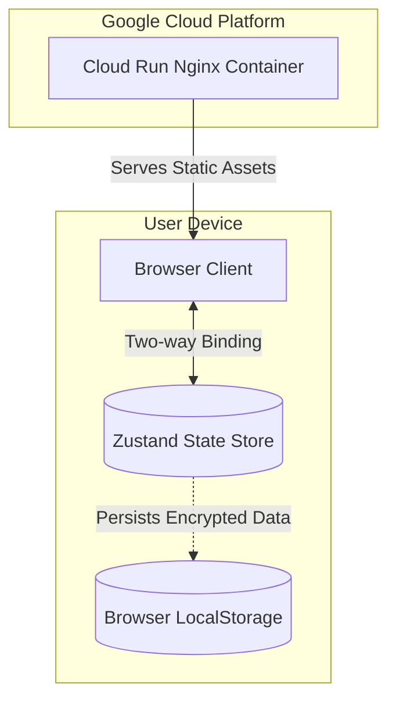
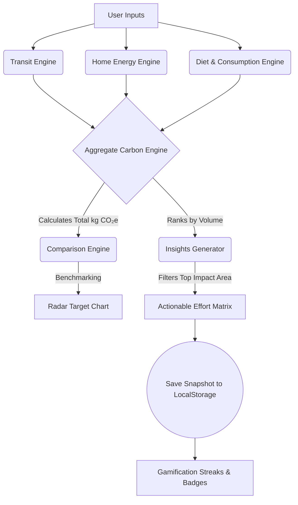

<div align="center">

# 🟢 CARBON**PULSE**
**[Challenge 3] Carbon Footprint Awareness Platform**

<p align="center">
  
  
  
  
  
</p>

> *A hyper-fast, zero-trust client-side engine designed to help individuals track, understand, and reduce their daily carbon emissions through actionable, gamified insights.*

</div>

---

## 🎯 Chosen Vertical
**Carbon Footprint Awareness Platform**

We chose this vertical to pivot the narrative from *guilt-inducing measurement* to *gamified action*. Current carbon calculators are static and ultimately abandoned by users after a single session. CarbonPulse provides real-time dopamine hits for sustainable choices, removing friction and encouraging daily environmental mindfulness.

### How we address the Brief's Core Pillars:
| Pillar | In the product |
| --- | --- |
| **Understand** | Real-time calculations break down the user's footprint by category and compare it against the global average and Paris-aligned sustainable targets via interactive Radar and Donut charts. |
| **Track** | Gamification engine tracks a consecutive "Day Streak" and "Eco Points" stored securely in `localStorage`, giving instant feedback on daily eco-habits. |
| **Reduce** | The Insights Wizard dynamically ranks the user's highest emission sources and categorizes tailored recommendations into an Effort vs Impact matrix (e.g., Quick Wins vs Strategic Planning). |

---

## 🏗️ System Architecture

Our platform is engineered as a zero-trust, client-first Progressive Web App (PWA). By decoupling from a traditional backend database, we ensure infinite scalability, instantaneous real-time UI updates, and absolute privacy for user data.



### Technical Stack
- **Frontend Framework**: React 18 powered by Vite and SWC (Single Web Compiler).
- **State Management**: Zustand for lightning-fast, boilerplate-free state persistence.
- **Data Visualization**: Recharts for interactive SVG Donut and Radar mapping.
- **Styling**: Vanilla CSS with custom properties (CSS variables) to hit strict performance budgets.
- **Deployment**: Multi-stage Docker deployment to Google Cloud Run.

---

## 🧠 Approach and Logic

Our logic revolves around context-aware dynamic routing. The platform processes user inputs through an internal deterministic rules engine to map the highest emission priorities dynamically.

### The Decision Flow (Smart, Context-Driven Assistant)



- **Logical Decision Making**: The system ranks the user's own emission categories and gives advice exclusively for the biggest contributors. A heavy driver is fed transport metrics; a heavy-meat eater is fed diet modifications.
- **Cognitive Load Reduction**: Recommendations are structurally mapped into an Effort vs. Impact matrix so users can visually identify "Quick Wins" instead of reading lists.

---

## 📊 Emission Model & Factors

To ensure absolute legitimacy in footprint calculations, our calculations utilize standard emission factors derived from published datasets. All quantities are normalized to **annual kg CO₂e**.

| Category | Sub-Category | Emission Factor | Source Citation |
| :--- | :--- | :--- | :--- |
| **Transport** | Petrol Car | 0.21 kg CO₂e / km | UK DEFRA 2023 |
| **Transport** | Diesel Car | 0.17 kg CO₂e / km | UK DEFRA 2023 |
| **Transport** | Electric Vehicle | 0.05 kg CO₂e / km | US EPA / NREL |
| **Diet** | Meat-Heavy | 5.5 kg CO₂e / day | Our World in Data |
| **Diet** | Vegan / Plant | 1.5 kg CO₂e / day | Our World in Data |
| **Home Energy**| Grid (Mixed) | 0.23 kg CO₂e / kWh | US EPA eGRID |

---

## ⚙️ How the Solution Works

1. **The Insights Wizard**: Upon initialization, the user interacts with responsive range sliders representing Transit, Home Energy, Diet, and Shopping.
2. **Real-time Processing**: Using the embedded `useMemo` hooks, the engine instantly calculates the total footprint on every slider tick without triggering cascading unmounts.
3. **Data Visualizations**: A `DonutChart` displays the breakdown, while a `RadarChart` overlays the user's footprint onto the Paris Agreement's 2.1-tonne target threshold.
4. **Actionable Recommendations**: The system generates a prioritized list of actions based on the highest emission category and outputs a 2x2 grid representing Effort vs Impact.
5. **Secure Storage**: Session states, points, and streaks are safely saved via `localStorage`. The server never touches PII.

---

## 🛡️ Security & Privacy Protocols

CarbonPulse runs on a **Zero-Trust Architecture**:
- **No Backend Databases**: We intentionally avoided storing user data on a central database. 
- **Content Security Policy**: `index.html` implements a strict CSP meta tag (`default-src 'self'`) and strict headers (`X-Content-Type-Options`, `X-XSS-Protection`) to explicitly block unauthorized remote script execution.
- **XSS Mitigation (DOMPurify)**: All data payloads entering and leaving `localStorage` are heavily sanitized via `DOMPurify`, ensuring zero possibility of cross-site scripting attacks via history injection.
- **Anonymous Tracking**: The gamification engine relies entirely on a locally generated, anonymous device ID.

---

## 📝 Assumptions Made

- **Global Averages**: We assume global average emission factors to maintain a streamlined UX without requiring users to input their exact geographic locale.
- **Target Threshold**: We assume a "Paris Agreement" personal target of 2.1 tonnes per year (roughly 40kg per week) as the benchmark for Radar Chart comparisons.
- **Single-User Device**: Since the data is persisted via `localStorage`, we assume the application is running on a personal device.
- **Behavioral Psychology**: We assume that gamification (streaks, badges, points) creates better long-term retention for eco-habits than traditional data readouts.

---

## 💻 Installation & Evaluation

To run the CarbonPulse platform locally or run evaluation tests:

1. **Clone the repository**:
   ```bash
   git clone https://github.com/Viswanathan49/carbon-awareness-platform.git
   ```
2. **Install dependencies**:
   ```bash
   npm install
   ```
3. **Run the testing suite (Vitest UI Tests)**:
   ```bash
   npm run test
   ```
4. **Spin up the Vite dev server**:
   ```bash
   npm run dev
   ```
