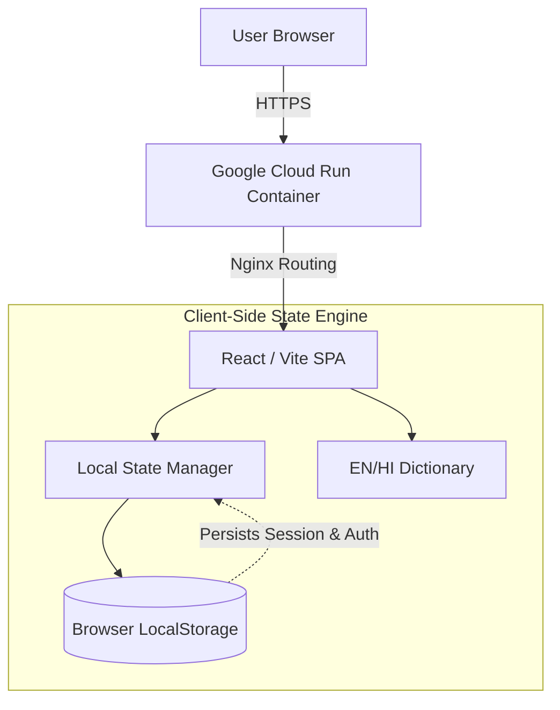

# 🟢 CARBON**PULSE**
**[Challenge 3] Carbon Footprint Awareness Platform**

  
  
  
  

> *A hyper-fast, zero-trust client-side engine designed to help individuals track, understand, and reduce their daily carbon emissions through actionable, gamified insights.*

 

## 🚀 The Dashboard Experience
Instead of a static calculator, CarbonPulse acts as a dynamic environmental command center.

| Feature | Technical Implementation | Impact |
| :--- | :--- | :--- |
| **🧠 Insights Wizard** | Multi-step React state engine | Personalizes advice based on Transit, Diet & Energy choices. |
| **🏆 Gamified Tracker** | Real-time `carbonScore` manipulation | Hooks users with instant point rewards for eco-habits. |
| **🔒 Zero-Trust Auth** | Browser `localStorage` persistence | Complete privacy. Zero backend vulnerabilities or latency. |
| **🌐 Native i18n** | Synchronous EN/HI state dictionary | Instant UI translation without heavy library bloat. |

 

## 🏗️ System Architecture

<b>👁️ Click to view the Application Architecture</b>

 

